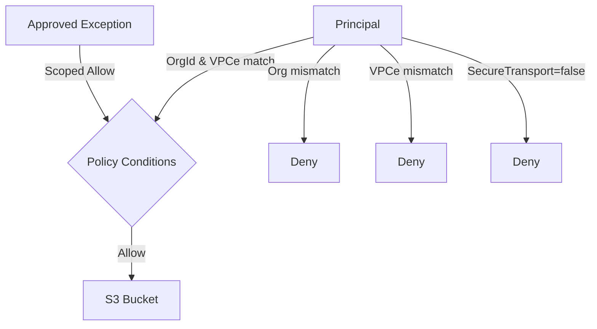

# Demo Walkthrough – Guardrails & Exceptions

## 1. Policy Visualization

Regenerate with `python tools/generate_diagram.py --vars BucketName=<bucket>,OrgId=<org>,VpcEndpointId=<vpce>`.

## 2. Cross-Account Access Attempt (Failure)
```bash
aws s3api list-objects-v2 \
  --profile external \
  --bucket $BUCKET_NAME \
  --max-items 1
# An error occurred (AccessDenied) when calling the ListObjectsV2 operation
```
The deny statements fire because the caller is outside `${OrgId}` or missing `${VpcEndpointId}`.

## 3. Exception PR → Approval → Scoped Allow → Expiry Reversion
1. Create `.exception-requests/partner-reader.json`:
   ```json
   {
     "principalArn": "arn:aws:iam::123456789012:role/PartnerReader",
     "actions": ["s3:GetObject"],
     "prefix": "partner-x/*",
     "expiresAt": "2025-12-31",
     "reason": "POC 파일 읽기만 허용"
   }
   ```
2. Raise a PR. CodeBuild runs `tools/merge_policy.py --requests-dir .exception-requests ...`, failing if the request is invalid or expired.
3. Manual approval stage shows `STATEMENT_COUNT`/`EXCEPTION_COUNT`; security approves only after verifying the diff.
4. CDK deploy applies the merged policy. PartnerReader can now `GetObject` under `partner-x/*`; other prefixes remain denied.
5. After `expiresAt`, the next pipeline run fails at merge time (“request ... expired”), automatically revoking access until the request is renewed or removed.

## 4. Policy Accuracy Checklist
| Coverage | Scenario | Validation |
|----------|----------|------------|
| Org restriction | External org denied | `pytest tests/test_policy_enforcement.py::test_org_id_mismatch_denied` |
| VPCe restriction | Wrong VPCe denied | `pytest ...::test_vpce_mismatch_denied` |
| Public block | Anonymous List/Get denied | `pytest ...::test_public_anonymous_denied` |
| Scoped exception | Approved principal allowed | `pytest ...::test_exception_allows_specific_principal` |
| Exception bounds | Prefix mismatch denied | `pytest ...::test_exception_scope_not_widened` |
| Expiry guard | Stale exception fails | `pytest ...::test_expired_exception_causes_failure` |
| SecureTransport | HTTP requests denied | `pytest ...::test_secure_transport_required` |

Use `scripts/cross_account_tests.sh <external-profile> <partner-profile>` for optional live validation.
